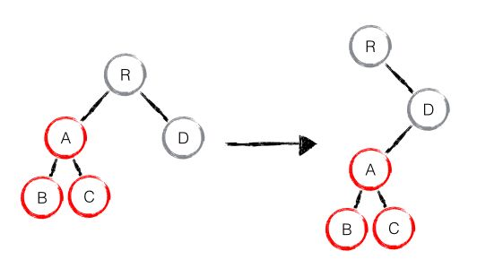

React笔记
===

## React简介

- React 起源于 Facebook 的内部项目，因为该公司对市场上所有 JavaScript MVC 框架，都不满意，就决定自己写一套，用来架设 Instagram 的网站。做出来以后，发现这套东西很好用，就在2013年5月开源了
- React 是一个用于构建用户界面的 JAVASCRIPT 库。
- React主要用于构建UI，很多人认为 React 是 MVC 中的 V（视图）
- React 拥有较高的性能，代码逻辑非常简单，越来越多的人已开始关注和使用它

[React中文官网](https://doc.react-china.org/)
[React英文官网](https://reactjs.org/)

## 为什么要学React

1. 使用组件化开发方式，符合现代Web开发的趋势
2. 技术成熟，社区完善，配件齐全，适用于大型Web项目（生态系统健全）
3. 由Facebook专门的团队维护，技术支持可靠
4. ReactNative - Learn once, write anywhere: Build mobile apps with React
5. 使用方式简单，性能非常高，支持服务端渲染
6. React非常火，从技术角度，可以满足好奇心，提高技术水平；从职业角度，有利于求职和晋升，有利于参与潜力大的项目


## React特点

1. 声明式设计 −React采用声明范式，可以轻松描述应用。
   1. 命令式编程：命令“机器”如何去做事情(how)，这样不管你想要的是什么(what)，它都会按照你的命令实现。
   2. 声明式编程：告诉“机器”你想要的是什么(what)，让机器想出如何去做(how) 
2. 高效 −React通过对DOM的模拟，最大限度地减少与DOM的交互。
3. 灵活 −React可以与已知的库或框架很好地配合。
4. JSX − JSX 是 JavaScript 语法的扩展。React 开发不一定使用 JSX ，但我们建议使用它。
5. 组件 − 通过 React 构建组件，使得代码更加容易得到复用，能够很好的应用在大项目的开发中。
6. 单向响应的数据流 − React 实现了单向响应的数据流，从而减少了重复代码，这也是它为什么比传统数据绑定更简单。

## React对比Vue.js

1. 首先，这两个框架，都是以**组件化**的思想进行开发的！
2. 什么是模块化：模块化是站在项目JS开发的角度去分析，更多的是在后台中应用模块化的思想【Node】
    + 模块化解决的问题：主要就是为了解决文件之间的相互依赖关系；
3. 什么是组件化：组件化，就是站在UI的角度，将一个页面拆分为多个互不相关的小组件；将来，我们可以很方便的去引用自己需要的组件，组件只需要定义一次，即可在任何地方去任意的使用；
    + 组件化的好处：随着项目规模扩大，开发会越来越方便；因为组件都是现成的；维护起来比较方便，只需要把组件一修改，那么所有引用组件的地方，都被修改了！对于扩展也方便；
4. Vue.js是如何实现组件化的呢：在vue.js中，通过一个后缀名为`.vue`的文件实现组件化；
    + template  定义组件的结构
    + script    定义组件的行为
    + style     定义组件的样式
5. 在React中如何实现组件化呢：其实，在React中，实现组件化的思想和vue不一样，并没有一个像`.vue`这样的模板文件，所以，也就没有 tempalte,script,style这些概念
    + 在React中，直接使用JS这门语言，来实现组件化，所有的组件结构、组件的行为、组件的样式，都可以通过JS直接来进行定义；
    + 所以说，在React的学习过程中，只要你会基本的JS，就能够开始学习React！
    + 只要你会用JS，那么就会定义React的组件；
6. 从开发团队上进行对比：
    + React的开发团队，是Facebook官方大牛团队，团队技术实力雄厚；
    + Vue：第一个版本，主要是作者尤雨溪进行维护的，所以1.X的版本体验并不是很好；但是从2.X版本开始，vue.js也有了一个自己开发维护团队，但是实力之间还是有一定差距的；
7. 从社区方面进行对比：
    + 由于React开源时间比较早，2013年就开源了，所以它的社区很完善，周边的一些相关插件比较完善；在社区中，相关的文档特别完善，而且一些Bug或者一些开发中常见的坑，好多人都已经踩过了，有了一套完整的技术解决方案；
    + Vue近两年才推出来，所以开源时间不如React，社区相对较小一些，一些相关的文档、插件、Bug的解决方案不如React多；会导致有一些问题，在网上或者社区中找不到对应的解决方案；
8. 从移动App开发方面：
    + 使用React这门技术，可以分分钟转到ReactNative的开发中；通过React的语法，也为开发人员提供了移动端App开发的体验；
    + VUE 这门技术，也提供了无缝的转移到移动端开发的体验，通过weex可以使用VUE的语法，进行移动端APP开发

## React核心概念

- 虚拟DOM(Virtual DOM)
- Diff算法(Diff Algorithm)
- 单向数据流渲染(Data Flow)
- 组件生命周期
- JSX
- 一切皆为组件

## 搭建开发环境

  `mkdir react-demo`

  `cd react-demo`

  `npm init -y`

  `npm install react react-dom -S`

  `npm install webpack webpack-cli webpack-dev-server babel babel-cli babel-core babel-loader@7 babel-preset-react babel-preset-env babel-preset-es2015 -D` （解析jsx和es6语法）

注意：babel 6.x版本必须安装babel-loader@7       babel 7.x 必须安装babel-loader@8

- webpack.config.js

```js
module.exports = {
  entry: './main.js',
  output: {
    path: '/',
    filename: 'index.js',
  },
  module: {
    rules: [{
      test: /\.js?$/,
      exclude: /(node_modules)/,
      use: {
        loader: 'babel-loader',
        options: {
          presets: ['env', 'react', 'es2015']
        }
      }
    }]
  }
}
```

- index.html

  ```html
  <!DOCTYPE html>
  <html lang="en">
  
  <head>
      <meta charset="UTF-8">
      <title>React App</title>
  </head>
  
  <body>
      <div id="root"></div>
      <script src="index.js"></script>
  </body>
  
  </html>
  ```

- main.js

  ```js
  // React 是 React 库的入口
  // React组件可以通过扩展 React.Component来定义
  import React, { Component } from 'react';
  // react-dom 包提供了 DOM 特定的方法，可以在你的应用程序的顶层使用，如果你需要的话，也可以作为 React模型 之外的特殊操作DOM的接口。 但大多数组件应该不需要使用这个模块。
  import ReactDom from 'react-dom';
  
  class App extends Component {
      render() {
          return <h1> Hello, world! </h1>
      }
  }
  
  // 渲染一个 React 元素到由 container 提供的 DOM 中，并且返回组件的一个 引用
  ReactDom.render(
      <App />,
      document.getElementById('root')
  )
  ```

- package.json

  ```json
  "start": "webpack-dev-server --inline --hot --open --port 8090 --mode development"
  ```


## React开发脚手架工具

[React脚手架](https://github.com/facebook/create-react-app) (Facebook官方出品)

`npm install -g create-react-app`

`create-react-app my-testproject` 

`cd my-testproject`

`npm start` or `yarn start`

## React版hello world

```js
import React from 'react';
import ReactDom from 'react-dom';

ReactDom.render(
  <h1> Hello, world! </h1>,
  document.getElementById('root')
)
```

## JSX

### JSX 基本使用
```js
const element = <h1>Hello, world!</h1>;
```
这种看起来可能有些奇怪的标签语法既不是字符串也不是 HTML。

它被称为 JSX， 一种 JavaScript 的语法扩展。 我们推荐在 React 中使用 JSX 来描述用户界面。

### JSX 嵌套元素

注意：只能包含**一个**根节点

```js
ReactDOM.render(
    // 模板只能包含一个根节点
  <div>
    <h1>hello</h1>
    <h2>jack</h2>
  </div>,
    document.getElementById('root')
);
```

### JSX 表达式

```js
import React from 'react';
import ReactDom from 'react-dom';

function formatName(user) {
  return user.firstName + ' ' + user.lastName;
}

const user = {
  firstName: '张',
  lastName: '三'
};

let num = 2

ReactDom.render(
  // 表达式只能放在大括号中，注意和vue一样，同样不支持if else语句
  // 如果里面放对象，会报错：Objects are not valid as a React child
  <div>
    <p>{ 1 + 1}</p>
    <p>{ '李' + '宁' }</p>
    <h1>hello {formatName(user)}</h1>
    <p>{num % 2 === 0 ? '偶数' : '奇数'}</p>
  </div>,
  document.getElementById('root')
)
```

### JSX注释

```js
    {
      // 这里是单行注释
    }
    {
      /*
      这里是多行注释
      这里是多行注释
      这里是多行注释
      这里是多行注释
      */
    }
```

### JSX属性

因为 JSX 的特性更接近 JavaScript 而不是 HTML , 所以 React DOM 使用 camelCase 小驼峰命名 来定义属性的名称，而不是使用 HTML 的属性名称
1. html的class属性改为**className**
2. html中label标签的for属性改为**htmlFor**
3. 标签中的自定义属性使用**data-**开头   [查看详情](https://reactjs.org/docs/dom-elements.html)

```js
import React from 'react';
import ReactDom from 'react-dom';

const user = {
  avatar: './avatar.jpg'
}

ReactDom.render(
  <div>
    <h1>hello</h1>
    <h2>jack</h2>
    </img>
    {
      // class ==> className
      // for ==> htmlFor
      // tabindex ==> tabIndex
      // 自定义属性需要以data-开头，规范
    }
    <p className="myStyle">类名</p>

    <label htmlFor="male">Male</label>
    <input type="radio" name="sex" id="male" />

    <a href="http://www.google.com/" tabIndex="2">百度</a>
    <a href="http://www.google.com/" tabIndex="1">Google</a>

    <p data-mytest="123">自定义属性</p>
  </div>,
  document.getElementById('root')
)
```

### JSX样式

```js
import React from 'react';
import ReactDom from 'react-dom';

let myStyle = {
  // React会自动在数值后面加上px
  fontSize: 100,
  color: '#FF0000'
}

ReactDom.render(
  <div>
    <h1>hello</h1>
    <h2 style={myStyle}>jack</h2>
  </div>,
  document.getElementById('root')
)
```

## React.createElement（）

```js
import React from 'react';
import ReactDom from 'react-dom';

// React.createElement 方法的作用，就是使用JS创建内存中的虚拟DOM，生成一些普通的对象
// 这个方法接收至少三个参数：
//   第一个参数： 指定要创建的元素标签类型[string]
//   第二个参数： 指定要创建的元素身上的属性[对象/null]
//   第三个参数： 指定当前创建的元素的子元素
let son = React.createElement('div', {className: 'color-red'}, '我是div里面的盒子')
let father = React.createElement('div', {className: 'color-red'}, '我是div盒子', son)

ReactDom.render(
  // 模板只能包含一个根节点
  father,
  document.getElementById('root')
)
```

## Virtual DOM

  - DOM

    

  - 浏览器渲染流程

    

  - 什么是Virtual DOM

      在React中，render执行的结果得到的并不是真正的DOM节点，结果仅仅是轻量级的**JavaScript对象**，我们称之为virtual DOM。

      虚拟DOM是React的一大亮点，具有batching(批处理)和高效的Diff算法。这让我们可以无需担心性能问题而”毫无顾忌”的随时“刷新”整个页面，由虚拟 DOM来确保只对界面上真正变化的部分进行实际的DOM操作。在实际开发中基本无需关心虚拟DOM是如何运作的，但是理解其运行机制不仅有助于更好的理解React组件的生命周期，而且对于进一步优化 React程序也会有很大帮助

  - 虚拟DOM VS 原生DOM

      如果没有 Virtual DOM，简单来说就是直接重置 innerHTML。这样操作，在一个大型列表所有数据都变了的情况下，还算是合理，但是，当只有一行数据发生变化时，它也需要重置整个 innerHTML，这时候显然就造成了大量浪费。

      比较innerHTML 和Virtual DOM 的重绘过程如下：

      innerHTML: render html string + 重新创建所有 DOM 元素

      Virtual DOM: render Virtual DOM + diff + 必要的 DOM 更新

      DOM 完全不属于Javascript (也不在Javascript 引擎中存在).。Javascript 其实是一个非常独立的引擎，DOM其实是浏览器引出的一组让Javascript操作HTML文档的API而已。在即时编译的时代，调用DOM的开销是很大的。而Virtual DOM的执行完全都在Javascript 引擎中，完全不会有这个开销。

      React.js 相对于直接操作原生DOM有很大的性能优势， 很大程度上都要归功于virtual DOM的batching 和diff。batching把所有的DOM操作搜集起来，一次性提交给真实的DOM。diff算法时间复杂度也从标准的的Diff算法的O(n^3)降到了O(n)。

  - 关于React 虚拟DOM的误解

    React 从来没有说过 “React 比原生操作 DOM 快”。React给我们的保证是，在不需要手动优化的情况下，它依然可以给我们提供过得去的性能。
    框架的意义在于为你掩盖底层的 DOM 操作，让你用更声明式的方式来描述你的目的，从而让你的代码更容易维护。没有任何框架可以比纯手动的优化 DOM 操作更快，因为框架的 DOM 操作层需要应对任何上层 API 可能产生的操作。
    React掩盖了底层的 DOM 操作，可以用更声明式的方式来描述我们目的，从而让代码更容易维护。

## Diff 算法

  Diff 算法会帮助我们计算出 Virtual DOM 中真正变化的部分，并只针对该部分进行实际 DOM 操作，而非重新渲染整个页面，从而保证了每次操作更新后页面的高效渲染，因此 Virtual DOM 与 diff 是保证 React 性能口碑的幕后推手。

  - 传统Diff算法

      传统 diff 算法通过循环递归对节点进行依次对比，效率低下，算法复杂度达到 O(n^3)，其中 n 是树中节点的总数。O(n^3) 到底有多可怕，这意味着如果要展示1000个节点，就要依次执行上十亿次的比较。这种指数型的性能消耗对于前端渲染场景来说代价太高了！现今的 CPU 每秒钟能执行大约30亿条指令，即便是最高效的实现，也不可能在一秒内计算出差异情况。

  - React Diff 算法

    [参考1](http://www.infoq.com/cn/articles/react-dom-diff/)

    [参考2](https://zhuanlan.zhihu.com/p/20346379?refer=purerender)

    * Web UI 中 DOM 节点跨层级的移动操作特别少，可以忽略不计
    * 不同类型的两个元素将产生不同的树(根元素不同结构树一定不同)
    * 开发人员可以在不同渲染之间使用key属性来表示哪些子元素是稳定的

    1. tree diff

    

      以上两棵树只会对同一层次的节点进行比较

      

      如果两棵树的根元素类型不同，React会销毁旧树，创建新树

      对于类型相同的React DOM 元素，React会对比两者的属性是否相同，只更新不同的属性

      React diff 的执行情况：delete A -> create A -> create B -> create C  (React 官方建议不要进行 DOM 节点跨层级的操作)

    2. component diff

        React 是基于组件构建应用的，对于组件间的比较所采取的策略也是简洁高效。

        * 如果是同一类型的组件，按照原策略继续比较 virtual DOM tree。

        * 如果不是，则将该组件判断为 dirty component，从而替换整个组件下的所有子节点。

        *  对于同一类型的组件，有可能其 Virtual DOM 没有任何变化，如果能够确切的知道这点那可以节省大量的 diff 运算时间，因此 React 允许用户通过 shouldComponentUpdate() 来判断该组件是否需要进行 diff。

        

        D和G为不同类型的组件,会直接删除组件D，重新创建组件G

    3. element diff

        

        如果每个节点都没有唯一的标识，React无法识别每一个节点，那么更新过程会很低效，即，将C更新成F，D更新成C，E更新成D，最后再插入一个E节点,如下图所示。可以看到，React会逐个对节点进行更新，转换到目标节点。而最后插入新的节点E，涉及到的DOM操作非常多。

        

        如果给每个节点唯一的标识（key），那么React能够找到正确的位置去插入新的节点

        

[diff演示](https://supnate.github.io/react-dom-diff/index.html)

## 组件-函数创建组件

**组件名称必须以大写字母开头**

```js
import React from 'react';
import ReactDom from 'react-dom';

const Hello = (props) => {
  return <div>你好，我叫{props.name}，我今年{props.age}岁</div>
}

const user = {
  name: 'jack',
  age: 18
}

const App = () => {
  return (
    <div>
      <Hello name="neil" age="25"/>
      <Hello {...user}/>
      <Hello />
    </div>
  )
}

ReactDom.render(
  <App />,
  document.getElementById('root')
);

```

## es6 class的学习

```js
function Father(firstName) {
  this.firstName = firstName
}

Father.prototype.getFirstName = function () {
  console.log(this.firstName);
}

Father.sayHello = function () {
  console.log('我是father');
}

function Son(firstName) {
  this.firstName = firstName;
}

let father = new Father('李');
father.getFirstName();
Father.sayHello();

Son.prototype = father;
let son = new Son('李2');
son.getFirstName();
```

```js
class Father {
  constructor(firstName) {
    this.firstName = firstName
  }

  getFirstName() {
    console.log(this.firstName);
  }

  static sayHello() {
    console.log('我是father');
  }
}

class Son extends Father {
  constructor(firstName) {
    super(firstName);
    console.log('son');
  }
}

let father = new Father('王');
father.getFirstName();
Father.sayHello();

let son = new Son('王2');
son.getFirstName();
```

## 组件-类创建组件

```js
import React, {Component} from 'react';
import ReactDom from 'react-dom';

class Hello extends React.Component {
  render() {
    return <div>Hello, {this.props.name}</div>
  }
}

const props = {
  name: 'jack',
  age: 18
}

class App extends React.Component {
  render () {
    return (
      <div>
        <Hello name="neil" age="25"/>
        <Hello {...props}/>
        <Hello />
      </div>
    )
  }
}

ReactDom.render(
  <App />,
  document.getElementById('root')
);
```

## props

作用：props给组件传递数据，一般用在父子组件之间

注意：props是只读的，无法给props添加或修改属性

props.children：获取组件的内容，比如：`<Hello>组件内容</Hello>` 中的`组件内容`

## 默认属性

给类（或者函数）绑定一个defaultProps属性

## [属性校验](http://www.css88.com/react/docs/typechecking-with-proptypes.html)

`npm i prop-types -S`

```js
import PropTypes from 'prop-types'

Hello.propTypes = {
  name: PropTypes.string,
  age: PropTypes.number.isRequired
}
```

## state

作用：用来给组件提供**组件内部**使用的数据
注意：
  - 只有通过class创建的组件才具有状态
  - 状态是私有的，完全由组件来控制

```js
import React, {Component} from 'react';
import ReactDom from 'react-dom';

class Hello extends Component {
  constructor(props) {
    super(props)
    this.state = {
      country: 'china'
    }
  }
  render() {
    return (
      <div>
        <p>Hello, {this.props.name}</p>
        <p>{this.state.country}</p>
      </div>
    )
  }
}

class App extends Component {
  render () {
    return (
      <div>
        <Hello name="neil"/>
      </div>
    )
  }
}

ReactDom.render(
  <App />,
  document.getElementById('root')
);
```

- **唯一可以分配 this.state 的地方是构造函数。**

- **不要直接修改 state(状态)， 类似于这样`this.state.comment = 'Hello'`，用 `setState()` 代替：`this.setState({comment: 'Hello'})`**

- **this.setState()方法更新是异步的，此时需要给它传递第二个参数，即一个回调来在更新之后执行**

  ```js
  class App extends Component {
    constructor(props) {
      super(props)
      this.state = {
        val: 'hello neil'
      }
      this.handleClick = this.handleClick.bind(this)
    }
    handleClick() {
      this.setState({
        val: 'hello world'
      })
      // this.setState()是异步的，所以这里的console.log打印出来并不是想要的
      console.log(this.state.val);
    }
    render() {
      return (
        <button onClick={() => this.handleClick}>{this.state.val}</button>
      )
    }
  }
  ```
- **组件的 state(状态) 可以向下传递，作为其子组件的 props(属性)，通常称为一个“从上到下”，或者“单向”的数据流**

## 函数式组件和类组件的区别

不同：类允许我们在其中添加本地状态(state)和生命周期钩子

相同：里面props是只读的，无法修改

重点：我们在开发的时候，凡是没有state的组件，就一定要使用函数式组件。为什么呢？因为使用函数的方式创建的组件更易于测试和数据的维护。也就是说，只要我们的组件没有state，我们就要使用函数式组件（也叫无状态组件）

## 案例：评论列表


```js
import React, { Component } from 'react'

export default class Home extends Component{
  constructor(props) {
    super(props)
    this.state = {
      commentList: [
        { user: '张三', content: '哈哈，沙发' },
        { user: '张三2', content: '哈哈，板凳' },
        { user: '张三3', content: '哈哈，凉席' },
        { user: '张三4', content: '哈哈，砖头' },
        { user: '张三5', content: '哈哈，楼下山炮' }
      ]
    }
  }
  createComments = () => {
    return this.state.commentList.map((item, index) => {
      return (
        <div key={index}>
          <h3>评论人：{item.user}</h3>
          <div>评论内容：{item.content}</div>
        </div>
      )
    })
  }
  render() {
    return (
      <div>
        <h1>评论案例列表</h1>
        <div>
          {this.createComments()}
        </div>
      </div>
    )
  }
}

```

改造版本：

```js
import React, { Component } from 'react'
const Comment = (props) => {
  return (
    <div>
      <h3>评论人：{props.user}</h3>
      <div>评论内容：{props.content}</div>
    </div>
  )
}
const NumberList = (props) => {
  return props.list.map((item, index) => {
    return <Comment {...item} key={index}/>
  })
}
export default class Home extends Component{
  constructor(props) {
    super(props)
    this.state = {
      commentList: [
        { user: '张三', content: '哈哈，沙发' },
        { user: '张三2', content: '哈哈，板凳' },
        { user: '张三3', content: '哈哈，凉席' },
        { user: '张三4', content: '哈哈，砖头' },
        { user: '张三5', content: '哈哈，楼下山炮' }
      ]
    }
  }
  // createComments = () => {
  //   return this.state.commentList.map((item, index) => <Comment key={index} {...item}></Comment>)
  // }
  render() {
    return (
      <div>
        <h1>评论案例列表</h1>
        <div>
          <NumberList list={this.state.commentList}></NumberList>
        </div>
      </div>
    )
  }
}
```


## 事件处理

* React 事件使用驼峰命名
* 通过 JSX , 你传递一个函数作为事件处理程序
  ```html
  <button onClick={activateLasers}>
    Activate Lasers
  </button>
  ```
* 绑定this（类方法中没有绑定this）

  1. 在构造函数中绑定（建议）
      ```js
        constructor(props) {
          super(props);
          this.state = {isToggleOn: true};

          // 这个绑定是必要的，使`this`在回调中起作用
          this.handleClick = this.handleClick.bind(this);
        }

        handleClick() {
          this.setState(prevState => ({
            isToggleOn: !prevState.isToggleOn
          }));
        }
      ```
  2. 使用箭头函数（属性初始化语法）
      ```js
        class LoggingButton extends React.Component {
          // 这个语法确保 `this` 绑定在 handleClick 中。
          // 警告：这是 *实验性的* 语法。
          handleClick = () => {
            console.log('this is:', this);
          }

          render() {
            return (
              <button onClick={this.handleClick}>
                Click me
              </button>
            );
          }
        }
      ```
  3. 回调中使用箭头函数
      ```js
        class LoggingButton extends React.Component {
          handleClick() {
            console.log('this is:', this);
          }

          render() {
            // 这个语法确保 `this` 被绑定在 handleClick 中
            return (
              <button onClick={(e) => this.handleClick(e)}>
                Click me
              </button>
            );
          }
        }
      ```
* 将参数传递给事件处理程序
    ```html
      <button onClick={(e) => this.deleteRow(id, e)}>Delete Row</button>
      <button onClick={this.deleteRow.bind(this, id)}>Delete Row</button>
    ```

## 生命周期(回过头去看diff算法)


组件的生命周期可分成三个状态:

1. Mounting(装载)

    当组件实例被创建并将其插入 DOM 时，这些方法将被调用

  - [`constructor()`](http://www.css88.com/react/docs/react-component.html#constructor)
  - [`componentWillMount()`](http://www.css88.com/react/docs/react-component.html#componentwillmount)
  - [`render()`](http://www.css88.com/react/docs/react-component.html#render)
    - 不要在render方法中调用 setState() 方法，否则会递归渲染，因为状态改变会重新调用render()，render()又重新改变状态
  - [`componentDidMount()`](http://www.css88.com/react/docs/react-component.html#componentdidmount)

2. Updating(更新)

    改变 props 或 state 可以触发更新事件。 在重新渲染组件时，这些方法将被调用

  - [`componentWillReceiveProps(newProps)`](http://www.css88.com/react/docs/react-component.html#componentwillreceiveprops)
  - [`shouldComponentUpdate(newProps, newState)`](http://www.css88.com/react/docs/react-component.html#shouldcomponentupdate)
    - 这个方法必须返回布尔值，根据布尔值决定是否重新渲染组件
  - [`componentWillUpdate(nextProps, nextState)`](http://www.css88.com/react/docs/react-component.html#componentwillupdate)
  - [`render()`](http://www.css88.com/react/docs/react-component.html#render)
  - [`componentDidUpdate(prevProps, prevState)`](http://www.css88.com/react/docs/react-component.html#componentdidupdate)

3. Unmounting(卸载)

    当一个组件从 DOM 中删除时，这个方法将被调用：

  - [`componentWillUnmount()`](http://www.css88.com/react/docs/react-component.html#componentwillunmount)


```js
class App extends Component {
  constructor(props) {
      super(props);	
      this.state = {
        data: 0
      }

      this.setNewNumber = this.setNewNumber.bind(this)
  };

  setNewNumber() {
      this.setState({data: this.state.data + 1})
  }

  render() {
      return (
        <div>
          <button onClick = {this.setNewNumber}>INCREMENT</button>
          {
            this.state.data !== 3
              ? <Content myNumber={this.state.data}></Content>
              : <div>Conten组件被销毁了</div>
          }
        </div>
      );
  }
}
class Content extends React.Component {

  componentWillMount() {
    console.log('Component WILL MOUNT!')
  }

  componentDidMount() {
    console.log('Component DID MOUNT!')
  }

  componentWillReceiveProps(newProps) {
    console.log('Component WILL RECIEVE PROPS!')
  }

  shouldComponentUpdate(newProps, newState) {
    return true;
  }

  componentWillUpdate(nextProps, nextState) {
    console.log('Component WILL UPDATE!');
  }

  componentDidUpdate(prevProps, prevState) {
    console.log('Component DID UPDATE!')
  }

  componentWillUnmount() {
    console.log('Component WILL UNMOUNT!')
  }

  render() {
    return (
        <div>
          <h3>{this.props.myNumber}</h3>
        </div>
    );
  }
}
```

## 组件通讯

### 父组件向子组件通讯

通讯是单向的，数据必须是由一方传到另一方。在 React 中，父组件可以向子组件通过传 props 的方式，向子组件进行通讯。

```js
class ChildOne extends Component{
  render() {
    return <p>{this.props.msg}</p>
  }
}

class Parent extends Component {
  constructor() {
    super()
    this.state = {
      val: 'hello world'
    }
  }

  render() {
    return (
      <div>
        <ChildOne msg={this.state.val}/>
      </div>
    );
  }
}
```

### 子组件向父组件通讯

而子组件向父组件通讯，同样也需要父组件向子组件传递 props 进行通讯，只是父组件传递的，是作用域为父组件自身的函数，子组件调用该函数，将子组件想要传递的信息，作为参数，传递到父组件的作用域中。

```js
class ChildOne extends Component{
  transferMsg = () => {
    this.props.getChildMsg('我报名了传智！')
  }
  render() {
    return <button onClick={this.transferMsg}>点击传值给父组件</button>
  }
}

class Parent extends Component {
  constructor() {
    super()
    this.state = {
      msg: 'hello world'
    }
  }
  
  handleMsg = (msg) => {
    this.setState({
      msg
    })
  }

  render() {
    return (
      <div>
        <div>儿子给我说：{this.state.msg}</div>
        <ChildOne getChildMsg={this.handleMsg} />
      </div>
    );
  }
}
```

### 兄弟组件间通讯

对于没有直接关联关系的两个节点，他们唯一的关联点，就是拥有相同的父组件。参考之前介绍的两种关系的通讯方式，如果我们要ChildOne和ChildTwo进行通讯，我们可以先通过 ChildOne 向 Parent 组件进行通讯，再由 Parent 向 ChildTwo 组件进行通讯。注意：这个方法有一个问题，由于 Parent 的 state 发生变化，会触发 Parent 及从属于 Parent 的子组件的生命周期。

```js
class ChildOne extends Component{
  transferMsg = () => {
    this.props.getChildMsg('我报名了传智！')
  }
  render() {
    return <button onClick={this.transferMsg}>点击传值给父组件</button>
  }
}

class ChildTwo extends Component {
  render() {
    return <p>我兄弟说：{this.props.msg}</p>
  }
}

class ChildThree extends Component {
  componentDidUpdate() {
    console.log('child 3 updated');
  }
  render() {
    return <p>child 3，我和兄弟1和兄弟2之间的通信没有任何关系</p>
  }
}

class Parent extends Component {
  constructor() {
    super()
    this.state = {
      msg: 'hello world'
    }
  }
  
  handleMsg = (msg) => {
    this.setState({
      msg
    })
  }

  render() {
    return (
      <div>
        <div>儿子给我说：{this.state.msg}</div>
        <ChildOne getChildMsg={this.handleMsg} />
        <ChildTwo msg={this.state.msg} />
        <ChildThree/>
      </div>
    );
  }
}
```

### Context (不推荐使用)

[Context](http://www.css88.com/react/docs/context.html)


## 受控表单和非受控表单

受控表单：设定了value值的input表单就是一个受控表单，此时的表单是不受你控制的,受react控制

```js
import React, {Component} from 'react';

class App extends Component {
  render() {
    return (
      <div>
        // 这个value值无法改变，要想改变，只能通过onChange事件
        <input type="text" value="Hello!"/>
      </div>
    );
  }
}

export default App;
```

```js
import React, {Component} from 'react';

class App extends Component {
  constructor(props, context) {
    super(props, context);
    this.state = {
      inputVal: 'hello'
    };
    this.handleChange = this.handleChange.bind(this);
  };

  handleChange(event) {
    this.setState({inputVal: event.target.value});
  }
  render() {
    return (
      <div>
        <input type="text" value={this.state.inputVal} onChange={this.handleChange}  />
      </div>
    );
  }
}

export default App;
```

不受控表单：value没有值的input是一个不受控组件。用户的任何输入都会反映到输入框中。默认值设置：`<input type="checkbox">` 和` <input type="radio">` 支持 defaultChecked，而 `<select> `和 `<textarea>` 支持 defaultValue（它仅会被渲染一次,在后续的渲染时并不起作用 ）。要获取非受控表单的值，需要借助于ref

```js
class NameForm extends React.Component {
  constructor(props) {
    super(props);
    this.handleSubmit = this.handleSubmit.bind(this);
  }

  handleSubmit(event) {
    alert('A name was submitted: ' + this.input.value);
    event.preventDefault();
  }

  render() {
    return (
      <form onSubmit={this.handleSubmit}>
        <label>
          Name:
          <input type="text" ref={(input) => this.input = input} />
        </label>
        <input type="submit" value="Submit" />
      </form>
    );
  }
}
```

| 特征                       | 不受控制表单（不推荐使用） | 受控表单 |
| -------------------------- | -------------------------- | -------- |
| 一次性检索（例如表单提交） | yes                        | yes      |
| 及时验证                   | no                         | yes      |
| 有条件的禁用提交按钮       | no                         | yes      |
| 执行输入格式               | no                         | yes      |
| 一个数据的几个输入         | no                         | yes      |
| 动态输入                   | no                         | yes      |

## [refs](http://www.css88.com/react/docs/refs-and-the-dom.html)

### 使用refs的场景

- 处理focus、文本选择或者媒体播放
- 触发强制动画
- 集成第三方DOM库

注意：**尽量少用refs**

### Dom元素上使用refs

通过回调函数来实现对dom的引用

定义：`ref={(input) => { this.textInput = input; }} `

使用：`this.textInput.focus() `

## 案例：TODO


App.js

```js
class App extends Component {
  constructor(props) {
    super(props)
    this.state = {
      list: [
        {id: 0, text: 'react'}
      ]
    }
  }
  handleSubmit = (val) => {
    let id = this.state.list.length === 0 ? 0 : this.state.list[this.state.list.length - 1].id + 1
    this.setState({
      list: this.state.list.concat({ id: id, text: val })
    })
  }
  handleDel = (id) => {
    let idx = this.state.list.findIndex(item => item.id === id)
    let list = this.state.list
    list.splice(idx, 1)
    this.setState({
      list
    })
  }
  render() {
    return (
      <div>
        <Input onSubmitFn={this.handleSubmit}/>
        {
          this.state.list.map((item, index) => {
            return <List {...item} key={item.id} onDelFn={this.handleDel}/>
          })
        }
      </div>
    )
  }
}
```

Input.js

```js
export default class Input extends Component {
  constructor(props) {
    super(props)
    this.state = {
      inputVal: ''
    }
  }
  getInputVal = (e) => {
    this.setState({
      inputVal: e.target.value
    })
  }
  transferVal = (e) => {
    let val = this.state.inputVal
    if (e.keyCode === 13 && val.trim()) {
      this.props.onSubmitFn(val)
      this.setState({
        inputVal: ''
      })
    }
  }
  render() {
    return (
      <input type="text"
        value={this.state.inputVal}
        onChange={this.getInputVal}
        onKeyUp={this.transferVal}
      />
    )
  }
}
```

List.js

```js
export default class List extends Component {
  delTodo = (id) => {
    this.props.onDelFn(id)
  }
  render() {
    return (
      <li>
        {this.props.text}
        <span style={{ color: 'red', marginLeft: '40px' }} onClick={() => this.delTodo(this.props.id)}>X</span>
      </li>
    )
  }
}
```

## 样式

### 内联样式
局限：hover等伪类不能够使用

```js
const styleComponent  = {
  header: {
    backgroundColor: "#333333",
    color: "#ffffff",
    "paddingTop": "15px",
    paddingBottom: "15px"
  }
}

// jsx中这样使用
<header style={styleComponent.header}></header>
```

### 从css文件引入

定义一个样式文件，直接引入（通过link标签）,然后给相应的元素加上className。它是全局的，会有污染。

也可以直接通过import引入，然后给相应的元素加上className。

### 内联样式表达式

```js
const styleComponent  = {
  header: {
    backgroundColor: "#333333",
    color: "#ffffff",
    "paddingTop": "15px",
    paddingBottom: (this.state.isMini) ? "10px" : "15px"
  }
}
```
### css模块化

`npm install style-loader css-loader -D `

```js
{
  test: /\.css$/,
  use: [
    'style-loader',
    {
      loader: 'css-loader',
      options: {
        modules: true,
        localIdentName: '[path][name]__[local]--[hash:base64:5]'
      }
    }
  ]
}
```

create-react-app不支持，[需要自己手动配置](https://segmentfault.com/a/1190000011225917)

使用类似下面这样

`import cssHeader from (./style.css)`

``<header className={cssHeader.header}></header>``

css模块化优点

- 所有样式都是local的，解决了命名冲突和全局污染问题
- class名生成规则配置灵活,可以以此压缩class名
- 只需引用组件的js就能搞定js和css
- 依然是写css代码，没有什么学习成本

[Css To React](https://staxmanade.com/CssToReact/)


## React-router
[React-router](https://reacttraining.com/react-router/web/guides/quick-start)

### 路由的基本使用(BrowserRouter, HashRouter, Route&Link)

`yarn add react-router-dom`  或者`npm i react-router-dom -S` 

路由组件无法接受两个以上子元素

只想匹配某个路由，加exact参数，表示要求路径与location.pathname必须完全匹配

使用<Switch>组件来包裹一组<Route>。<Switch>会遍历自身的子元素（即路由）并对第一个匹配当前路径的元素进行渲染，后面的不会在渲染

HashRouter: `http://localhost:8080/#/abc/def`

BrowserRouter: `http://localhost:8080/abc/def`

如果有服务器端的动态支持，建议使用 ``BrowserRouter``，否则建议使用 ``HashRouter``。
原因在于，如果是单纯的静态文件，假如路径从 / 切换到 /a 后，此时刷新页面，页面将无法正常访问。

二者的替换方法很简单，我们在引入 react-router-dom 时，如以下：

```js
import { BrowserRouter as Router } from 'react-router-dom'
```

### 路由参数

参数获取：`this.props.match.params.xxx`

### Switch, Redirect

```js
import {Redirect} from 'react-router-dom'

<Redirect to="/404">

// 编程式导航： `this.props.history.push('/xxx/')`
```

```js
class Product extends Component {
  componentDidMount() {
    console.log(this.props);
  }
  jumpTo = () => {
    this.props.history.push(`${this.props.match.url}/buy`)
  }
  render() {
    return (
      <div>
        这里显示商品编号 {this.props.match.params.id} <button onClick={this.jumpTo}>选购</button>
        <Route path="/product/:id/buy" render={() => <div>我们这里有XXXXXXXX</div>}></Route>
      </div>
    )
  }
}

class App extends Component {
  constructor(props) {
    super(props)
    this.state = {
      productList: [
        {id: 11, title: '水果'},
        {id: 22, title: '肉类'},
        {id: 33, title: '蔬菜'},
      ]
    }
  }
  render() {
    return (
      <Router>
        <div>
          <ul>
            <li><Link to="/">首页</Link></li>
            <li><Link to="/product/11">蔬菜</Link></li>
            <li><Link to="/product/22">水果</Link></li>
            <li><Link to="/product/33">肉类</Link></li>
          </ul>
          <Switch>
            <Route path="/" exact render={() => <div>首页</div>}></Route>
            <Route path="/product/:id" render={(props) => <Product {...props}/>}></Route>
            <Route path="/404" render={() => <div>404</div>}></Route>
            <Redirect to="/404"></Redirect>
          </Switch>
        </div>
      </Router>
    )
  }
}
```

## [fetch](https://developer.mozilla.org/zh-CN/docs/Web/API/Fetch_API/Using_Fetch)

## UI框架

[Ant Design](http://ant.design/index-cn)

[Material UI](http://www.material-ui.com/#/)

## 项目开始

### [豆瓣接口文档](https://developers.douban.com/wiki/?title=movie_v2)

`baseURL: https://api.douban.com`

第一页    0   = 》(currentPage - 1)  * count

第二页    12

第三页   24

| 接口说明 | URL                    | 请求方式 | 参数               | 参数说明                                                     |
| -------- | ---------------------- | -------- | ------------------ | ------------------------------------------------------------ |
| 正在热映 | /v2/movie/in_theaters  | GET      | ?start=xx&count=12 | start表示当前页数据从哪一条开始展示，默认为0，count表示每页显示多少条 |
| 即将上映 | /v2/movie/coming_soon  | GET      | ?start=xx&count=12 | -                                                            |
| top250   | /v2/movie/top250       | GET      | ?start=xx&count=12 | -                                                            |
| 详情页   | /v2/movie/subject/ :id | GET      | id                 | 电影id                                                       |


### 项目初始结构搭建( 直接利用create-react-app脚手架)

### [Ant Design](http://ant.design/index-cn) 介绍

[Ant Design 在 create-react-app中使用](http://ant.design/docs/react/use-with-create-react-app-cn)

使用之后可以将样式引入注释掉了，即`@import '~antd/dist/antd.css';`，以后直接`import { Button } from 'antd';`就能够自动引入组件的js和css

### 项目页面布局

### 电影页布局

### 电影页刷新Menu.Item默认选中

### fetch-jsonp介绍

### 电影列表页数据渲染

### 电影列表中MovieBox组件创建

```css
/* App.css中的一些样式 */
.App {
  text-align: center;
}
.logo {
  width: 120px;
  height: 31px;
  background: rgba(255,255,255,.2);  
  margin: 16px 24px 16px 0;
  float: left;
}

.moviebox{
  width: 180px;
  text-align: center;
  padding: 4px;
  margin: 10px 5px;
  border: 1px solid #eee;
  box-shadow: 0 0 10px #bbb;
  transition: all 0.2s;
}

.moviebox:hover{
  box-shadow: rgba(0, 0, 0, 0.3) 0px 19px 60px, rgba(0, 0, 0, 0.22) 0px 15px 20px;
}

#root {
  height: 100%;
}
```


### 电影列表页分页

### 电影列表刷新Menu.Item默认选中


## Native App(原生App)
原生语言程式是为了特定的操作系统而编码，用的也是特定操作系统的开发套件(Platform SDK)


**所用技术**
  - IOS：Object-C,Swift
  - Android：Java

**优点**
  - 执行速度快，效能佳。适合需要极快速反应的程式、复杂的动画、游戏…等类型
  - 对硬体装置的支援度较好，可以应用几乎所有硬体上的功能。例如：相机功能、 GPS地理定位、测速计、磁力计、陀螺仪…等
  - 可以在官方线上商店上架，设定下载App的人是否要付钱，用以赚取费用
  - 可以离线使用

**缺点**
  - 不同装置的原生App必须使用指定的程式语言及SDK开发。例如若App要用原生程式开发，且希望在iOS 、 Android 、 Windows Mobile上都能下载使用，就必须要开发3套不同程式语言写的App
  - 开发过程中，要测试原生App功能必须先经过程式编译(Compile) 、部署安装在装置上，才能够执行测试。一但有任何问题，每次修改都必须重新编译、部署安装的流程才行，开发测试较不方便。(透过装置模拟器可以测试部份功能，但模拟执行的速度也很慢)
  - 部份App的开发者必须要缴年费给官方，才能开发原生App及将App上架
  - 将App上架需要经过官方审核程序
  - 付费App下载需让官方抽成
  - 原生App 程式若有更新，就需要重新上架、审核，而使用者也必须更新或重新下载，才能使用新的功能
  - 开发成本高


## Web App(网页App)


**所用技术**
  - 纯HTML, CSS, JavaScript

**优点**
  - 具有跨平台特性
  - 开发过程中， Web App只要使用装置的浏览器输入网址即可执行测试。若有任何问题，程式修改后，可以快速的进行测试，甚至有时只需要简单的重新整理网页即可
  - Web App不需要支付官方开发者年费，也不需要至官方应用程式商店上架、审核或让官方抽成
  - Web App有任何功能更新，只需要在后端网站主机修改即可，使用者不需要重新下载安装，就可以随时使用最新的功能

**缺点**
  - Web App执行速度没有原生应用程式来的快，较不适合需要极快速反应的程式、复杂的动画、游戏…等
  - Web App依赖浏览器执行，针对不同的浏览器可能会有不同的兼容性问题
  - 在网路断线的状态下， Web App 有可能完全无法继续操作(除非在开发时一并开发离线支援功能)
  - Web App对硬体装置的支援度不好，许多硬体上的功能可能无法使用。例如：测速计、磁力计

## Hybrid App(混合App)
混合语言程式的部份代码会以Web技术编写，如HTML5, CSS和JavaScript。这些程式都是被包裹在原生容器(Native Container)和透过手机上的浏览器引擎来呈现HTML和执行JavaScript，最后可在包装后像原生APP一样上架至应用程式商店


**优点**
  - 具有跨平台特性
  - 有些框架工具，可让混合式App也能像原生App般，控制硬体装置。例如：相机功能、 GPS地理定位、测速计、磁力计、陀螺仪…等
  - 可以在官方线上App商店上架，设定下载App的人是否要付钱，用以赚取费用

**缺点**
  - 较需复杂运算的功能或游戏，用混合式App开发方式，效能可能还是比不上原生App
  - 对硬体装置的支援度仍比不上原生App
  - App程式若有更新，就需要重新上架、审核，而使用者也必须更新或重新下载，才能使用新的功能

## 三种App对比


| Feature                                | Native                                                       | Hybrid                                                       | Web                                                          |
| -------------------------------------- | ------------------------------------------------------------ | ------------------------------------------------------------ | ------------------------------------------------------------ |
| Skills needed to reach Android and iOS | Skills needed to reach Android and iOS                       | HTML, CSS, Javascript, Mobile Development Framework          | HTML, CSS, Javascript                                        |
| Distribution                           | App Store/Market                                             | App Store/Market                                             | Web                                                          |
| Development speed                      | [Slow](https://readwrite.com/2013/01/09/how-long-does-it-take-to-build-a-native-mobile-app-infographic/) | Moderate                                                     | Fast                                                         |
| Development cost                       | [High](http://resources.kinvey.com/docs/State+of+Enterprise+Mobility+Survey+2014+-+Kinvey.pdf) | Moderate                                                     | Fast                                                         |
| Maintenance cost                       | [High](http://www.comentum.com/mobile-app-development-cost.html) | Moderate                                                     | Low                                                          |
| Graphical performance                  | High                                                         | Moderate                                                     | Moderate                                                     |
| App performance                        | High                                                         | Moderate                                                     | Moderate                                                     |
| Camera                                 | Yes                                                          | Yes                                                          | [Yes](https://davidwalsh.name/demo/camera.php)               |
| Push Notifications                     | Yes                                                          | Yes                                                          | No                                                           |
| Contacts                               | Yes                                                          | Yes                                                          | No                                                           |
| Offline access                         | Yes                                                          | Yes                                                          | [Yes](https://www.html5rocks.com/en/features/offline)        |
| Geolocation                            | Yes                                                          | Yes                                                          | [Yes](https://www.mrc-productivity.com/blog/2012/06/yes-you-can-use-gps-with-mobile-web-apps-with-proof/) |
| File upload                            | Yes                                                          | Yes                                                          | [Yes](https://www.html5rocks.com/en/features/file_access)    |
| Gyroscope                              | Yes                                                          | Yes                                                          | [Yes](https://developers.google.com/web/fundamentals/native-hardware/device-orientation/) |
| Accelerometer                          | Yes                                                          | Yes                                                          | [Yes](https://developers.google.com/web/fundamentals/native-hardware/device-orientation/) |
| Swipe Navigation                       | Yes                                                          | Yes                                                          | Yes                                                          |
| Microphone                             | Yes                                                          | Yes                                                          | [Yes](https://www.html5rocks.com/en/tutorials/getusermedia/intro/) |
| Best Used For                          | Games or consumer-focused apps where performance, graphics, and overall user experience are necessary | Apps that do not have high performance requirements, but need full device access | Apps that do not have high performance requirements, and do not need push notifications or access to contacts |

[重力感应](http://matthew.wagerfield.com/parallax/)


## 移动App的主流开发技术(前端角度)

### Hybrid App

  - [Ionic](https://ionicframework.com/docs/) + Angular + Cordova + ionic css
  - [Framework7](http://framework7.io/)
  - Titanium Appcelerator
  - [Onsen UI](https://onsen.io/)
  - Xamarin (based on C#)

  打包DCloud，APICloud，**PhoneGap**(Cordova)，AppCan

## Native App

  - [React Native](https://reactnative.cn/docs/0.51/getting-started.html)
  - [Weex](http://weex.apache.org/cn/guide/)


## 演示快速打包一个Hybrid App

  + `npm install ionic cordova -g`
  + `ionic start myApp tabs` Install the free Ionic Pro SDK and connect your app?选择No
  + `ionic cordova platform add android`
  + `ionic serve`
  + `ionic cordova build android` [可能需要单独配置Gradle，点击获取方法](https://www.cnblogs.com/crazyprogrammer/p/6958462.html)
  + 注意文件夹中不要包含中文
  + 可能还会报错，按照报错说明去Android SDK Manager安装相应的包 


  [HBuilder](http://www.dcloud.io/)


## 环境配置

### Java环境配置

- 安装 `jdk-8u161-windows-x64.exe`（32位系统请选择32位的版本）安装到默认路径
- 添加系统环境变量`JAVA_HOME`，值为`C:\Program Files\Java\jdk1.8.0_161`
- 修改系统环境变量`Path`，在`Path`之后新增`%JAVA_HOME%\bin;%JAVA_HOME%\jre\bin;`
- 新建**系统环境变量**`CLASSPATH`，值为`.;%JAVA_HOME%\lib\dt.jar;%JAVA_HOME%\lib\tools.jar;`
- 保存所有的系统环境变量，同时退出系统环境变量配置窗口，然后运行cmd命令行工具，输入`javac`，如果能出现javac的命令选项，就表示配置成功

### Node.js环境配置

（略过）

### C++环境配置

大多数情况下操作系统自带C++环境，不需要手动安装C++环境(略过)
如果运行报错，则需要手动安装visual studio中的C++环境；如下图，但只需要勾选C++就可以了


### 安装Git环境

Git安装完毕后，会自动配置到系统环境变量中；可以通过运行`git --version`来检查是否正确安装和配置了Git的环境变量；

### 安装Python环境

  1. 注意：安装Python时候，只能**安装2.×的版本**，注意勾选安装界面上的`Add Python to path`，这样才能自动将Python安装到系统环境变量中；
  2. 安装完毕之后，可以在命令行中运行`python`，检查是否成功安装了python。

### Android环境配置

[离线下载地址1](http://mirrors.neusoft.edu.cn/android/repository/)
[离线下载地址2](http://mirrors.zzu.edu.cn/android/repository/)

- Android SDK Tools安装
  - 安装`installer_r24.4.1-windows.exe`到`C:\Android`下面
  - 打开安装的目录，将`platform-23_r03`(react-native必须依赖这个)复制到`platforms`文件夹下，解压到当前文件夹下后，删除压缩文件
  - 解压`platform-tools_r27.0.1-windows`，到`C:\Android`下面
  - 解压`build-tools_r23.0.1-windows.zip(react-native必须依赖这个)`、`build-tools_r26-windows.zip(weex必须依赖这个)`，并将解压出来的文件夹，分别改名为版本号`23.0.1`、`26.0.0`；在安装目录中新建文件夹`build-tools`，并将改名为版本号之后的文件夹，放到新创建出来的`build-tools`文件夹下
  - 在安装目录中，新建`extras`文件夹，在`extras`文件夹下新建`android`文件夹；解压`m2responsitory`文件夹，放到新建的`extras -> android`文件夹下
  - 打开Android SDK Manager 软件，点开Android 8.0.0(API 26), 下载SDK Platform 26 (因为网站上没有这个文件，我们无法下载解压，只能在线安装)
  - 配置安装环境变量：在系统环境变量中新建`ANDROID_HOME`，值为`C:\Android`，然后再系统环境变量`Path`中添加`%ANDROID_HOME%\tools;%ANDROID_HOME%\platform-tools;`

  
  打包weex程序的时候可能会报的错：
  

## [React Native快速上手](https://reactnative.cn/docs/0.51/getting-started.html)

+ 安装完node后建议**设置npm镜像**以加速后面的过程（或使用科学上网工具）。注意：**不要使用cnpm！**cnpm安装的模块路径比较奇怪，packager不能正常识别！
  - `npm config set registry https://registry.npm.taobao.org --global`
  - `npm config set disturl https://npm.taobao.org/dist --global`
+ Yarn、React Native的命令行工具（react-native-cli）
  Yarn是Facebook提供的替代npm的工具，可以加速node模块的下载。React Native的命令行工具用于执行创建、初始化、更新项目、运行打包服务（packager）等任务。
  - `npm install -g yarn react-native-cli`
  - 安装完yarn后同理也要设置镜像源：
      - `yarn config set registry https://registry.npm.taobao.org --global`
      - `yarn config set disturl https://npm.taobao.org/dist --global`
+ 运行`react-native init AwesomeProject --version 0.55.4`创建React-Native项目
+ 运行`cd AwesomeProject`切换到项目根目录中，运行`adb devices`来确保有设备连接到了电脑上
+ 运行下一条命令之前，要确保有设备连接到了电脑上，可以运行`adb devices`查看当前接入的设备列表，打包好的文件，放到了下项目文件的`android\app\build\outputs\apk`目录下
+ 运行`react-native run-android`打包编译安卓项目，并部署到模拟器或开发机中 
+ [入坑指南](http://www.open-open.com/lib/view/open1477469117948.html)

  > **问题1：开启悬浮框权限；**<br/>
  > **问题2：Could not get BatchedBridge, make sure your bundle is packaged correctly**<br/>
  > 解决方案：在终端中，进入到项目的根目录，执行下面这段命令行：<br/>
  > `react-native bundle --platform android --dev false --entry-file index.android.js --bundle-output android/app/src/main/assets/index.android.bundle --assets-dest android/app/src/main/res/`<br/>
  > 运行之前，需要确保`android/app/src/main/`目录下有`assets`文件夹，如果没有，手动创建之~，再运行上面的命令；

  > **问题3：could not connect to development server**<br/>
  > 解决方案：晃动手机，唤起设置属性窗口，点击“Dev settings”，再点击Debuug server host 出现设置ip地址窗口，填写Ip地址和端口号8081，例如`192.168.1.111:8081`

## [Weex快速上手](http://weex.apache.org/cn/guide/index.html)

  + 安装依赖:Weex 官方提供了 weex-toolkit 的脚手架工具来辅助开发和调试。首先，你需要最新稳定版的 Node.js 和 Weex CLi。
  + 运行`npm install -g weex-toolkit`安装Weex 官方提供的 `weex-toolkit` 脚手架工具到全局环境中
  + 运行`weex create project-name`初始化Weex项目
  + 进入到项目的根目录中，打开cmd窗口，运行`weex platform add android`安装android模板，首次安装模板时，等待时间较长，建议fq安装模板
  + 打开`android studio`中的`安卓模拟器`，或者将`启用USB调试的真机`连接到电脑上，运行`weex run android`，打包部署weex项目
  + 部署完成，查看项目效果
  + 打包之后的apk文件在项目的`platforms\android\app\build\outputs\apk`目录下


## 项目开始

### react-native-cli生成项目的目录结构分析

### 修改项目模板的首屏

### 一些常用组件的使用

- View

  - Text
  - Button
  - TextInput
  - Image
  - ScollView
  - ActivityIndicator 
  - ListView

### 配置路由

  [react-native-router-flux](https://github.com/aksonov/react-native-router-flux/blob/master/README3.md)

`npm i react-native-router-flux -S`


```js
import {Scene, Router} from 'react-native-router-flux';

class App extends React.Component {
  render() {
    return(
      <Router>
        <Scene key="root">
          <Scene key="login" component={Login} title="Login"/>
          <Scene key="register" component={Register} title="Register"/>
          <Scene key="home" component={Home}/>
        </Scene>
    	</Router>
     ) 
  }
}
```


### 首页

  [react-native-swiper](https://github.com/leecade/react-native-swiper)

### TouchableHightlight

### [打包apk](https://www.jianshu.com/p/32a99c273be1)

## [Redux](http://www.redux.org.cn/)基本概念

Redux 是 JavaScript （不是React，其他的像Angular也可以使用，甚至单纯的JavaScript也阔以使用）状态容器，提供可预测化的状态管理
应用中所有的 state 都以一个对象树的形式储存在一个单一的 store 中。 惟一改变 state 的办法是触发 action，一个描述发生什么的对象。 为了描述 action 如何改变 state 树，你需要编写 reducers。


### Redux核心内容

  * Store
    store是Redux的实例对象，专门用来存放应用的状态，它里面保存有应用的state，action，reducer。注意：应用程序只能有**唯一一个**store
    store有以下职责：

      - 维持应用的 state；
      - 提供 getState() 方法获取 state；
      - 提供 dispatch(action) 方法更新 state；
      - 通过 subscribe(listener) 注册监听器;
      - 通过 subscribe(listener) 返回的函数注销监听器。
    ```js
    import { createStore, combineReducers } from 'redux'
    // 创建一个Redux实例，让它去管理应用中的state
    // 1. createStore 函数可以传三个参数，分别是reducer (Function)；初始时的state和enhancer (Function)，enhancer 是一个组合 store creator 的高阶函数，返回一个新的强化过的 store creator
    // 2. combineReducers()函数会将多个不同的reducer合并成一个大的reducer函数，合并后的 reducer 可以调用各个子 reducer，并把它们返回的结果合并成一个 state 对象。由 combineReducers() 返回的 state 对象，会将传入的每个 reducer 返回的 state 按其传递给 combineReducers() 时对应的 key 进行命名。
    const store = createStore(combineReducers({userReducer}));
    
    // store.subscribe()方法可以监听store的更新
    store.subscribe(() => {
        console.log("Store updated!", store.getState());
    });
    ```

  * State

    State 是一个普通对象，用来保存应用的数据。例如：
    ```js
    const initialState = {
        result: 1,
        lastValues: [],
        username: "Max"
    };
    ```
    state对象中的数据不能随意修改，要想更改state中的数据，需要用到发起一个action，这个action是一个对象，描述了你要干什么事情

  * Action

    * action

      Action 就是一个普通 JavaScript 对象，用来描述发生了什么事情。我们约定，action 内必须使用一个字符串类型的 type 字段来表示将要执行的动作，type 会被定义成字符串常量。
      ```js
      {
          type: "SET_AGE",
          payload: 30
      }

      // 提交一个action
      store.dispatch({
        type: "SET_AGE",
        payload: 30
    });

      ```
      但它并没有去修改state，为了去做action描述的事情，我们需要用reducer将action和state联系起来。

    * action创建函数

      action创建函数是用来创建action的函数，就是专门用来生成action对象的函数，例如：
      ```js
      function addTodo(text) {
        return {
          type: ADD_TODO,
          payload: text
        }
      }
      ```

  * Reducer

    reducer是一些纯函数，它接收两个参数：state和action，返回值是一个新的state。
    注意：
      1. 不要修改state，而是返回一个新的对象
      2. 在 default 情况下返回旧的 state

    ```js
      const userReducer = (state = {
          name: "Max",
          age: 27
      }, action) => {
          switch (action.type) {
              case "SET_NAME":
                  state = {
                      ...state,
                      name: action.payload
                  };
                  break;
              case "SET_AGE":
                  state = {
                      ...state,
                      age: action.payload
                  };
                  break;
          }
          return state;
      };
    ```

## React 和 Redux连接

`npm i react-redux -S`

1. 如何将react 和redux进行连接，也就是如何让react应用程序拥有redux中的state

```js
import {Provider} from 'react-redux'
render(
    <Provider store={store}>
        <App />
    </Provider>,
    document.getElementById('app')
)
```

2. 其他组件如何调用redux中的state或者触发reducer函数呢

```js
import {connect} from "react-redux";

const mapStateToProps = (state) => {
  return {
    // state.userReducer这个userReducer，必须和上面const store = createStore(combineReducers({userReducer}));中的userReducer名字对应
    user: state.userReducer
  };
};

const mapDispatchToProps = (dispatch) => {
    return {
        setName: (name) => {
            dispatch({
                type: "SET_NAME",
                payload: name
            });
        }
    };
};

export default connect(mapStateToProps, mapDispatchToProps)(App);

// 接下来，可以通过this.props.user.name获取state中的name值
// 通过this.props.setName('xxx')触发一个reducer
```
